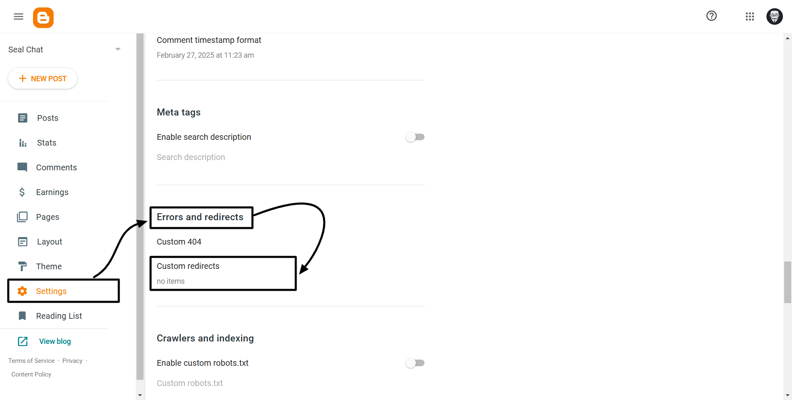
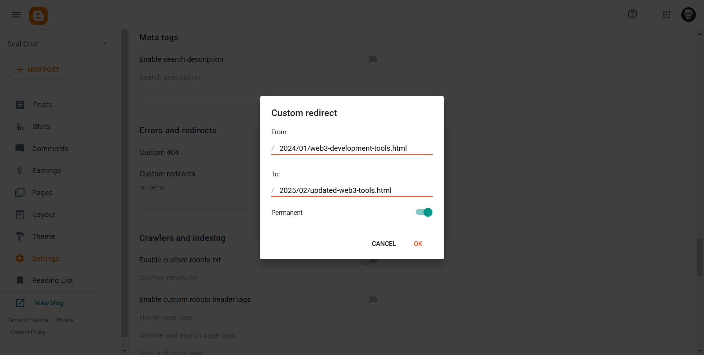

Viewers who move blog posts or delete pages or modify their Blogger site structure commonly see the "**404 Page Not Found**" error message. Loads of broken links serve to both decrease visitor satisfaction and lower your site's search engine positions. The solution? Setting up redirects in Blogger.

You will learn to set up smooth redirects in Blogger although the platform does not provide native redirect functionality. Let’s dive in!

## Why Redirects Matter for Your Blogger Site

The how requires an understanding of why redirects matter for Blogger sites. Redirects are essential for:

1. **Preserving SEO Value:** Search engines cannot maintain knowledge about deleted or relocated content since the connection between them gets lost. Redirects maintain your SEO value after moving page content on a website.
2. **Improving User Experience:** Users do not appreciate encountering dead ends so performance enhancement is crucial. The navigation tool through redirect links drives users toward suitable content.
3. **Fixing Broken Links:** Your redirects ensure external sites keeping their link referrals when they use your old URLs.

## What is Redirection?
Users along with search engines automatically redirect through the technique known as redirection to a different URL. A redirect functions similar to detour signs online since they redirect users to different URLs when important pages move or disappear. The technique serves to maintain SEO performance along with user interface quality and properly addresses website connection failures.

## Types of Redirection

1. **301 Redirect (Permanent) :** Tells browsers and search engines that a page has permanently moved to a new URL.
2. **302 Redirect (Temporary) :** Indicates a temporary move. The original URL will likely return.
3. **Meta Refresh Redirect :** Uses HTML meta tags to redirect users after a set time (e.g., 5 seconds).
4. **JavaScript Redirect :** Relies on JavaScript code to send users to a new page.

## How to Set Up Redirects in Blogger: 2 Simple Methods

- **Method 1:** Using the Blogger Setting
- **Method 2:** Using the HTML Template for Advanced Redirects
- **Method 3:** Using the Layout Editor

### Method 1: Using the Blogger Setting
This method works best for redirecting **individual posts or pages**. Here’s how to do it:

**Step 1 :-** Go to your [Blogger Dashboard](https://www.blogger.com/).

**Step 2 :-** Now, got to **Settings** ➟ **Errors and redirects** ➟ **Custom Redirects** ➟ Click on **Add**.


**Step 3 :-** The '**Add**' button will bring up a form to add the `from` and `to` URLs where you can choose between permanent (301) redirection or not. 

You can set redirection in blogger by entering the old url slug at the top section and the new url slug at the bottom section followed by an '**OK**' click. You must remove the domain portion from the URL before continuing. 


And that’s it. Your redirection configuration on the blogger website has been completed successfully.


### Method 2: Using the HTML Template for Advanced Redirects
For bulk redirects or site-wide changes, editing your blog’s template is more efficient.

1. **Back Up Your Template:** Go to `Theme` ➟ `Backup/Restore` ➟ `Download Theme`.
2. **Edit the Template:** Navigate to `Theme` ➟ `Edit HTML` and Locate the `<head>` section.
3. **Add Redirect Rules:** Insert this code just below the `<head>` tag:

```javascript
<script type="text/javascript">
// Redirect list
const redirects = {
  "/old-url-1/": "/new-url-1/",
  "/old-url-2/": "/new-url-2/"
};

const currentPath = window.location.pathname;
if (redirects[currentPath]) {
  window.location.replace(redirects[currentPath]);
}
</script>
```

- Add all your **old** and **new URLs** inside the redirects object.

4. **Save and Test:** Check multiple URLs to confirm the redirects work.

### Method 3: Using the Layout Editor

This method works best for redirecting **individual posts or pages**. Here’s how to do it:

1. **Open Your Blogger Dashboard**: Go to **Layout** > **Add a Gadget** in the section where you want the redirect (e.g., the header or footer).
2. **Choose an HTML/JavaScript Gadget**: Paste the following code:

```javascript
<script type="text/javascript">
if (window.location.pathname === "/old-post-url/") {
  window.location.href = "https://yourblog.com/new-post-url/";
}
</script>
```

Replace `/old-post-url/` with the original URL path (e.g., `/2023/01/my-old-post.html`).

Replace `https://yourblog.com/new-post-url/` with the full URL of the new page.

3. **Save and Preview:** Always test the redirect to ensure it works!

> Pro Tip: Use this method sparingly, as too many JavaScript redirects can slow down your site.


## Conclusion
Setting up redirects in Blogger might seem tricky at first, but with these methods, you’ll keep your visitors happy and your SEO intact. Whether you’re fixing a broken link or moving your site to a new domain, redirects are your best friend.
